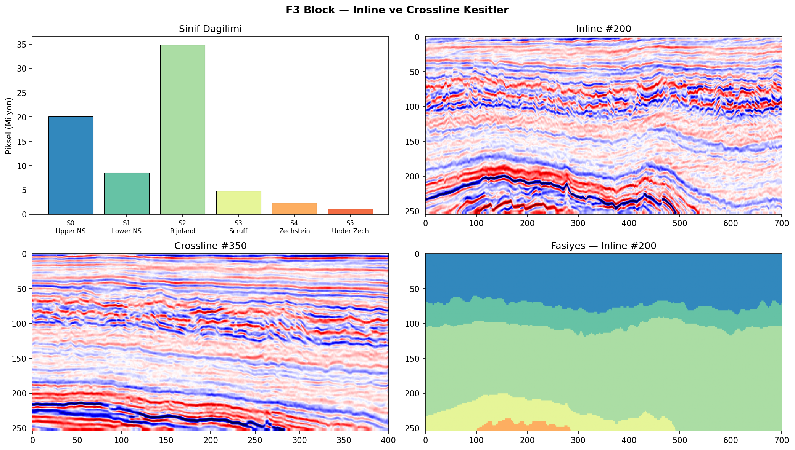
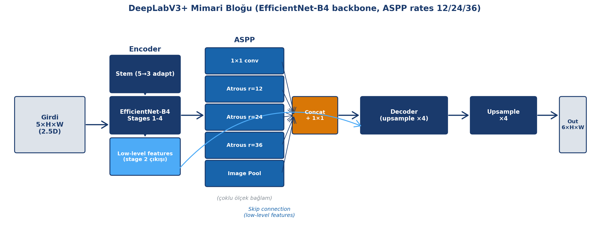
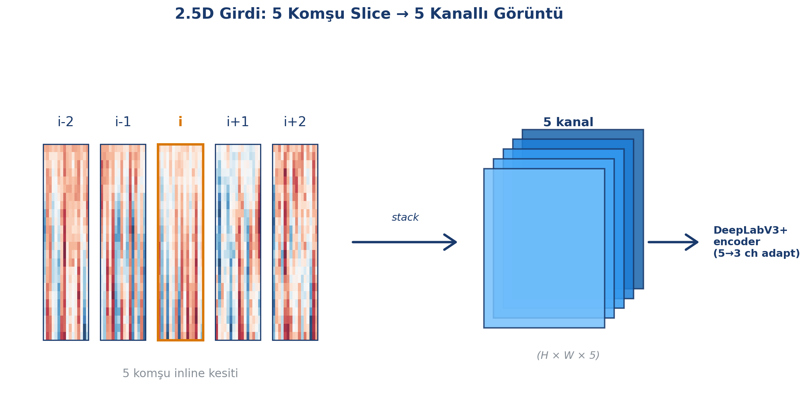
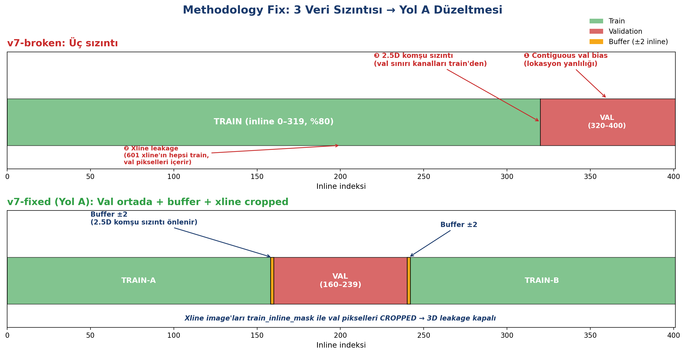
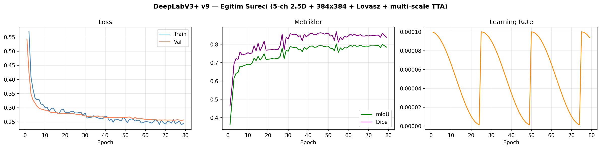
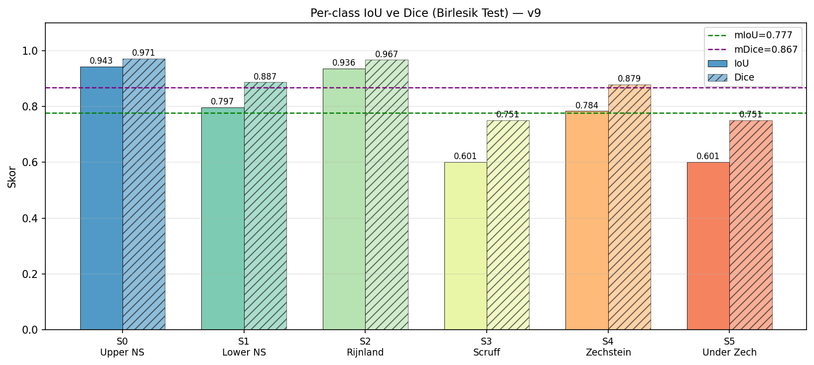
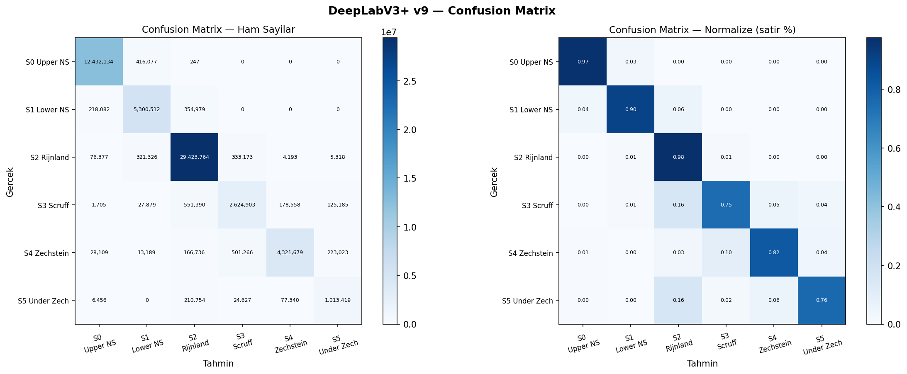
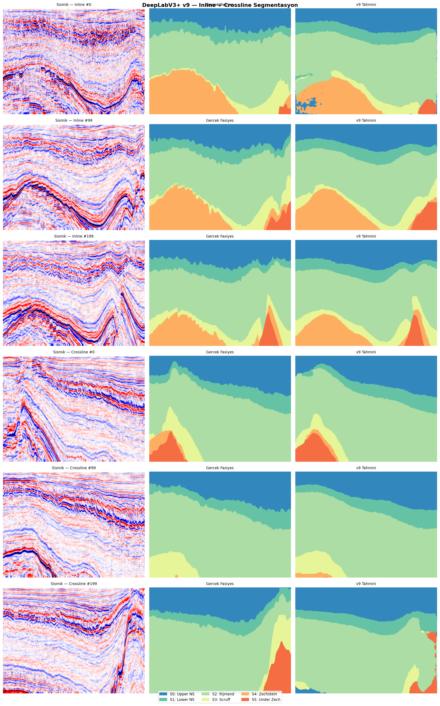
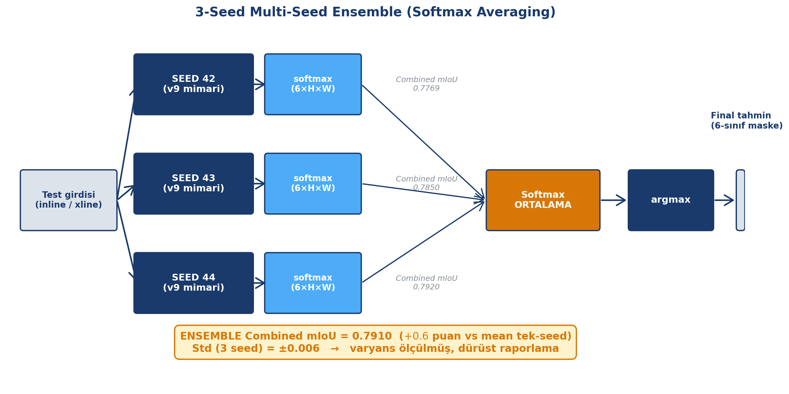
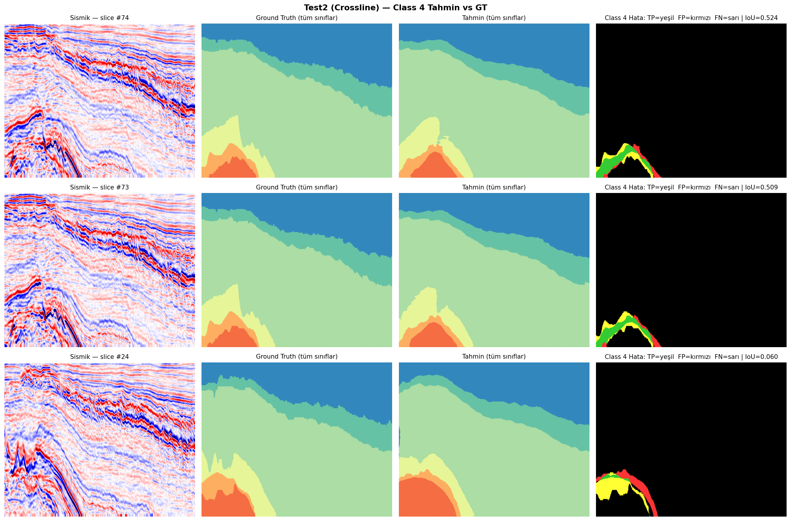

<!-- _class: lead -->
# DeepLabV3+ ile Sismik Fasiyes Segmentasyonu

**F3 Hollanda Benchmark Üzerinde Multi-Seed Ensemble Yaklaşımı**

Mehmet Kisli
Bilgisayarda Görme — Yüksek Lisans Semineri
15 Haziran 2026

---

# Sunumun Üç Mesajı

1. **Modern bir 2.5D DeepLabV3+ baseline** kurduk (Combined mIoU **0.791 ± 0.006**).

2. Erken sürümde fark ettiğim **3 veri sızıntısı** hatasını düzeltip dürüstçe rapor ettim.

3. Multi-seed ensemble ile **tek-seed raporlamanın istatistiksel riskini** somut bir bulgu olarak gösterdim.

---

# Problem: Sismik Fasiyes Sınıflandırması

- Yeraltı jeolojik yapılarının sismik dalga yansıma örüntülerine göre kategorilere ayrılması
- Petrol/gaz endüstrisinde rezervuar karakterizasyonu için kritik
- **Hâlâ jeofizikçiler tarafından elle yapılıyor** — bir 3D blok günler alır, yorumcular arası tutarsızlık

**Hedef:** Derin öğrenme ile piksel-bazlı otomatikleştirme.

---

# Veri Seti: Netherlands F3 Block

- Kuzey Denizi, ~16×24 km2
- **Eğitim:** 401 inline × 701 xline × 255 derinlik (1 volüm)
- **Test1:** 200 inline (inline yönü) — daha homojen
- **Test2:** 601 xline (xline yönü) — Zechstein diapiri, kritik test
- **Kaynak:** Alaudah 2019, Zenodo 10.5281/zenodo.3755060

**6 jeolojik fasiyes sınıfı, ağır sınıf dengesizliği.**

---

# Sınıf Dağılımı

| # | İsim | Train piksel % | Zorluk |
|---|---|---:|---|
| 0 | Upper North Sea | 28.09 | Kolay |
| 1 | Lower North Sea | 11.89 | Orta |
| 2 | Rijnland | **48.59** | Baskın — naive model "hep Rijnland" der |
| 3 | Scruff | 6.64 | Zor (ince bant) |
| 4 | Zechstein | 3.28 | **Çok zor (Test2 morfolojik fark)** |
| 5 | Under Zechstein | 1.51 | En zor (azınlık) |

→ Pixel Accuracy yetmez, **mIoU** ana metrik.

---

# Literatür Timeline

| Yıl | Çalışma | Yaklaşım |
|---|---|---|
| 2019 | **Alaudah et al.** | DeconvNet section + aug + skip (benchmark referansı) |
| 2020 | Liu et al. (Geophysics) | 3D CNN + semi-sup GAN — section 2D > patch 3D |
| 2022 | Wiley/Hindawi | DeepLabv3+ + SegNet ensemble (farklı split) |
| 2023 | CONSS, SFM | Kontrastif semi-sup, ViT pretrain (Parihaka) |
| 2025 | AdaSemSeg, UmixClick | Few-shot DA, interactive seg |

**Bizim konum:** Alaudah geographic split'e sadık, modern DeepLabV3+ + 2.5D + multi-seed baseline.

---

# Literatür: Karşılaştırılabilirlik Sorunu

| Yöntem | mIoU iddiası | Sorun |
|---|---:|---|
| Wiley 2022 | 0.9392 | Random split + 7 sınıf — **karşılaştırılamaz** |
| CONSS 2023 | 0.9462 | Kendi train/test düzeni — **karşılaştırılamaz** |
| Alaudah 2019 best | FwIoU 0.832, PA 0.905 | Ana karşılaştırma referansı |
| AdaSemSeg 2025 | FwIoU 0.86 | Farklı F3 split |
| UmixClick 2025 | 0.7666 | Interactive (tıklama) — adil değil |

**Sonuç:** 0.94+ sayılarının çoğu metodolojik farklarla şişirilmiş. Adil kıyas Alaudah baseline.

---

# Mimari: DeepLabV3+ + EfficientNet-B4

 <!-- TODO: Task 10 diyagram -->

**Üç tasarım gerekçesi:**

1. **ASPP** (atrous rates 12, 24, 36) — sismik tabakaların çoklu kalınlık ölçeklerini yakalar.

2. **EfficientNet-B4 + ImageNet** — düşük-seviyeli filtreler (kenar, doku) transfer.

3. **2.5D girdi** — 3D bağlamı RGB-uyumlu, VRAM-dostu şekilde.

**~24M parametre**, smp framework.

---

# 2.5D Girdi Şeması

 <!-- TODO: Task 8 diyagram -->

- Her inline `i` için: **[i-2, i-1, i, i+1, i+2]** stack
- → 5 kanallı görüntü (RGB benzeri ama 5 ch)
- EfficientNet-B4 ilk konvolüsyon 5-ch'e adapte edildi
- **3D'nin VRAM patlamasından kaçınır**

**Neden 3D değil?** Liu 2020: F3'te section 2D > patch 3D. Tek volüm = global bağlam parçalanır.

---

# Loss: QuadrupleLoss

**`L = 0.30·LS-CE + 0.25·Dice + 0.25·Focal + 0.20·Lovász`**

| Bileşen | Rolü |
|---|---|
| Label-Smoothing CE | Aşırı güveni önler |
| Dice | Doğrudan örtüşme |
| Focal (γ=2) | Azınlık sınıflara odak |
| **Lovász-Softmax** | **IoU surrogate** (Berman 2018) — IoU'yu doğrudan optimize |

**Dengeleyiciler:** Focal α = 1/freq, WeightedRandomSampler (C4/C5 ×10).

---

# Methodology Fix: 3 Veri Sızıntısı

 <!-- TODO: Task 9 diyagram -->

**v7-broken'da tespit edilen 3 sızıntı:**

1. **Contiguous val bias** — son %20 inline blok = lokasyon yanlılığı

2. **3D xline leakage** — xline image'ları val pikselleri içeriyordu

3. **2.5D komşu sızıntısı** — val sınırı komşu kanallar train'den

**Somut göstergesi:** val mIoU 0.66 ↔ test mIoU 0.79 (val < test = istatistiksel anomali).

---

# Yol A Fix

| Düzeltme | Nasıl |
|---|---|
| Val'i ortaya kaydır | `val_inline = [160, 240)` (80 slice) |
| Train'i ikiye böl | `[0, 158) ∪ [242, 401)` |
| Buffer ekle | ±2 inline (2.5D komşu sızıntısı için) |
| Xline'ı cropla | `train_inline_mask` ile val pikselleri çıkar |

→ Val artık train tarafından **çevrelenmiş**, sızıntı kapalı.

---

# Eğitim Eğrileri (v9, SEED=42)

Cosine Annealing Warm Restarts (T_0=25) her 25 epoch'ta restart → yeni local minimum.

---

# Methodology Fix Öncesi/Sonrası — KRİTİK SLAYT

| Sürüm | val mIoU | Test1 | Test2 | Combined | Yorum |
|---|---:|---:|---:|---:|---|
| v7-**broken** | 0.66 | 0.79 | 0.70 | 0.79 | val << test, **leakage anomalisi** |
| v7-**fixed** | 0.84 | 0.76 | 0.67 | 0.77 | val ≥ test, normal — gerçek baseline |
| **v9 ensemble** | **0.81** | **0.80** | 0.68 | **0.791 ± 0.006** | mimari iyileştirme + multi-seed |

**Mesaj:**
- v7-broken'ın 0.79'u **yapay** — leakage'dan besleniyordu.
- v7-fixed 0.77 = **gerçek genelleme** ortaya çıktı.
- v9 ensemble 0.791 = **gerçek +2.4p ilerleme**.

---

# v9 Ensemble — Ana Sonuçlar

| Metrik | Test1 | Test2 | **Combined** |
|---|---:|---:|---:|
| **mIoU** | **0.804** | 0.677 | **0.791 ± 0.006** |
| Dice | 0.886 | 0.772 | 0.877 |
| Pixel Accuracy | 0.938 | 0.942 | **0.940** |
| Mean Class Acc | 0.901 | 0.753 | **0.873** |

**3-seed ensemble** (SEED 42+43+44 softmax averaging), multi-scale TTA, 384×384.

**Standart sapma raporlandı** — tek-koşu raporlamadan kaçınıldı.

---

# Per-Class IoU (Ensemble Combined)

| # | Sınıf | IoU | Test2 |
|---|---|---:|---:|
| 0 | Upper NS | 0.951 | 0.949 |
| 1 | Lower NS | 0.812 | 0.815 |
| 2 | Rijnland | 0.941 | 0.941 |
| 3 | Scruff | 0.629 | 0.562 |
| 4 | **Zechstein** | 0.803 | **0.183** ← |
| 5 | Under Zech | 0.609 | 0.612 |

**Class 4 Test2 = 0.183** → modelin tek belirgin zayıf noktası.

---

# Confusion Matrix (v9 Ensemble, Combined)

**Class 4 hatasının çoğu Under Zechstein (C5) ile karışıyor** — komşu tabaka. Tesadüfi değil, morfolojik benzerlik.

---

# Segmentasyon Karşılaştırma

Sismik girdi (sol) | Ground Truth (orta) | v9 ensemble tahmini (sağ)

Test1'de örtüşme yüksek; Test2 Zechstein bölgesinde **sınır hataları** ama tam kayıp yok.

---

<!-- _class: lead -->
# Kritik Akademik Bulgu

## Single-Seed Bias

**Tek-seed sonuçların istatistiksel riski — somut bir vaka.**

---

# Single-Seed Bias: Class 4 Test2 Gözlemi

**v9'u SEED=42 ile eğittik → Class 4 Test2 IoU = 0.230.**
v7-fixed'in 0.118'inden göreli +%96 iyileşme. Sevindirici!

Sonra 3-seed ensemble için 43 ve 44'ü de eğittik:

| SEED | Class 4 Test2 IoU |
|---|---:|
| 42 (ilk raporlanan) | **0.230** ← outlier-pozitif |
| 43 | 0.156 |
| 44 | 0.163 |
| **Mean ± Std** | **0.183 ± 0.04** |
| Ensemble | 0.183 |

→ **0.230 şanslı bir çıkış, gerçek değer 0.183.**

---

# Single-Seed Bias: Üç Ders

1. **Modelin Class 4 Test2 gerçek performansı 0.183, 0.230 değil.** Tezde dürüstçe raporluyoruz.

2. Eğer tek-seed ile yetinseydik **şanslı çıkışı 'mimari katkı' olarak** literatüre rapor ederdik — bu bilim değil, gürültü.

3. **Segmentasyon literatüründe pek çok yayın hâlâ tek-seed.** Bu bulgu o pratiğin somut riskini gösteriyor.

→ **Ana sayımız `Combined mIoU 0.791 ± 0.006` — varyans dahil.**

---

# SFM Mini-Bölüm: Foundation Model Denemeleri

**Sismic Foundation Model (Sheng 2024):** 192 sismik survey, 2.3M slice ile MAE pretrain ViT-B/16. F3 facies için literatürde sayı yoktu.

| Metrik | v9 ensemble | SFM v1 | SFM v2 | **Lider** |
|---|---:|---:|---:|---|
| Combined mIoU | **0.791** | 0.728 | 0.768 | v9 |
| Test1 mIoU | 0.804 | 0.721 | 0.782 | v9 |
| Test2 mIoU | 0.677 | 0.667 | 0.659 | v9 |
| **Class 4 Test2** | 0.183 | **0.270** | 0.20 | **SFM v1** |
| Best val mIoU | 0.81 | 0.81 | **0.823** | SFM v2 |

**Bulgu:** Ortalamada v9 kazanıyor, **Class 4 Test2'de SFM v1 lider**. → Future work: heterojen ensemble.

---

# 3-Seed Ensemble + Softmax Averaging

 <!-- TODO: Task 11 diyagram -->

**Algoritma:**
1. v9 mimarisi, **SADECE SEED değişkeni** (42, 43, 44)
2. Her model → multi-scale TTA softmax çıktısı
3. 3 modelin softmax'ları **ortalanır**
4. `argmax` → final prediction

**Ensemble katkısı:** +0.006 (mean=0.785, ensemble=0.791) — single-seed bias söndürme efekti.

---

# Literatür Karşılaştırma — Savunma

| Yöntem | mIoU | PA | MCA | Eval |
|---|---:|---:|---:|---|
| Alaudah 2019 best | — | 0.905 | 0.817 | Orijinal (701×255) |
| **v9 ensemble (bizim)** | **0.791 ± 0.006** | **0.940** | **0.873** | **384×384 resized** |
| AdaSemSeg target-only | — | 0.91 | 0.89 | Farklı split |
| UmixClick (interactive) | 0.767 | 0.935 | — | Belirsiz |

**Dürüst iddia:** "Alaudah baseline seviyesinde, methodology hataları düzeltilmiş, multi-seed varyans raporlanmış."

**"Geçtik" demiyoruz** çünkü original-resolution evaluator henüz yok.

---

# Limitations 1/2

**1. Class 4 Test2 başarısızlığı (IoU 0.183)** — Zechstein'in anisotropik morfolojisi. Domain adaptation gerekli (AdaSemSeg, EarthAdaptNet).

**2. Original-resolution evaluator eksik** — 384×384 resized eval'de hesapladık, Alaudah orijinalde. "Geçtik" iddiası yapamıyoruz.

**3. Tek-volüm eğitim** — Penobscot/Parihaka transfer test edilmedi. Cross-volume genelleme bilinmiyor.

---

# Limitations 2/2

**4. K-fold cross-validation yok** — 5-fold = 5x GPU maliyeti. Multi-seed (3 seed) kısmen telafi ediyor.

**5. Tam ablation matrisi yok** — Sınırlı ablation paketi yapıldı (TTA, Lovász, 5-ch). 26=64 kombinasyon tezin uzun versiyonunda.

**6. Donanım kısıtı** — RTX 3060 Ti 8 GB. Daha büyük backbone/batch sınırlı.

→ **Bilimsel olgunluk = sınırları gizlemek değil, raporlamak.**

---

# Class 4 Hatalarının Jeolojik Yorumu

**Test2 Class 4 IoU = 0.183 — *ama hatalar rastgele değil***

Zechstein GT piksellerinin tahmin dağılımı (v9 SEED 42):

| Tahmin | Pay | Anlam |
|---|---:|---|
| Zechstein (doğru) | **%34.5** | ✅ |
| **Under Zechstein** | **%43.9** | tuz-altı kompleks (komşu birim) |
| **Scruff** | **%21.1** | üst sınır şeyl ardalanması |

**Jeolojik anlam:** Zechstein evaporit + Under Zechstein üst Permiyen birimleri **stratigrafik komşu** — crossline yönde sismik imzaları **ayırt edilemez** hâle geliyor.

> **Model rastgele tahmin yapmıyor — *jeolojik olarak makul* yanlışlar yapıyor. Bu istatistik hatası değil, *veri-yön bağımlılığı*.**

---

# Türkiye Petrol Endüstrisi için Anlamı

**Doğrudan deployment değil — *methodology blueprint***

- **TPAO / Türkiye Petrolleri** havzaları (GD Anadolu, Trakya, Karadeniz) F3'ten farklı: bindirme tektoniği, gerçek tuz tektoniği, yüksek gürültü
- F3 model ağırlıkları doğrudan transfer edilemez — *ama* bu çalışmanın **3 katmanı doğrudan kullanılabilir**:

| Katman | TPAO / TP'ye faydası |
|---|---|
| **Methodology (Yol A)** | Şirket-içi etiketli verilerde leakage-free split şablonu |
| **Multi-seed + ablation** | İç projelerde dürüst varyans raporlama disiplini |
| **PyTorch pipeline** | 1-2 hafta içinde havza-spesifik fine-tune başlangıç noktası |

- **Endüstri kazanımı:** Manuel yorumlama *günler* → otomasyon *saatler*; **interpreter tutarlılığı** artar
- **Sınır:** Class 4 (tuz) — özellikle Tuz Gölü / GD Anadolu için havzaya özel etiketleme + fine-tune gerektirir

> **"Bu çalışma TPAO'nun proprietary verisi üzerinde ~2 haftada operasyonel hale gelebilecek bir başlangıç noktasıdır."**

---

# Future Work

1. **Türkiye havzaları için transfer learning** — TPAO/TP işbirliği ile havza-spesifik fine-tune; ilk hedef: Tuz Gölü (tuz tektoniği) ve Trakya (overpressure ardalanması)

2. **Heterojen ensemble** (v9 + SFM v1) — Class 4 Test2'de iki yaklaşımın güçlerini birleştirme. Düşük maliyet, yüksek potansiyel.

3. **Domain adaptation** — AdaSemSeg / EarthAdaptNet ile Test2 yön bağımlılığına çözüm.

4. **Original-resolution evaluator** — Alaudah birebir kıyas için gerekli.

5. **Çapraz-volüm transfer** — F3 → Penobscot / Parihaka zero-shot test.

6. **K-fold + tam ablation** — Tezin uzun versiyonu için.

---

<!-- _class: lead -->
# Teşekkür

**Anahtar Mesajlar:**

1. Combined mIoU **0.791 ± 0.006** — varyansla raporlanmış
2. Methodology hatalarını **gizlemek yerine dürüstçe düzelttim**
3. **Single-seed sonuç yanıltıcı olabilir** — multi-seed gerekli
4. Class 4 Test2 hâlâ **alan adaptasyonu** açık problemi
5. **Türkiye petrol endüstrisi için** doğrudan deployment değil, ~2 haftada operasyonel hale gelebilecek **methodology blueprint**

---

## Sorularınız?

**İletişim:** mehmettkisli@gmail.com
**Kod:** github.com/[user]/sismik-proje
